### 我想，无论是买啤酒的人，还是卖啤酒的人，都没有想过故事会发展成这样，因为故事的开始明明就很平常啊  
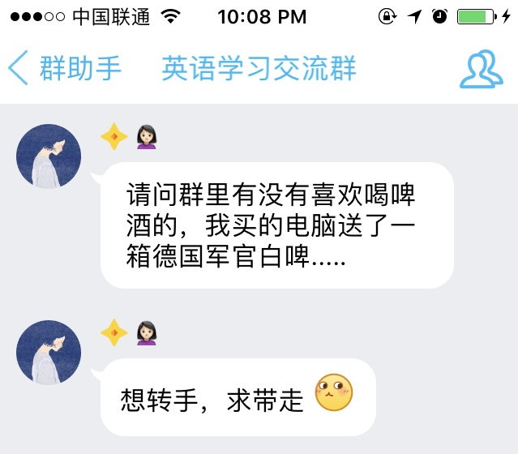  
### 但是谁让我忍不住一颗想要炫耀冰箱的心  
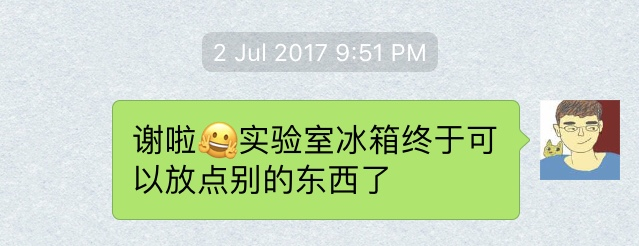  
### 幸好，一开始我给你留下了一个错误的印象，你愿意搭理一个看上去还算有趣的人  
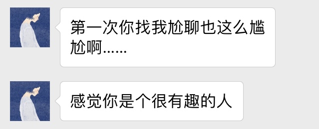  
### 但是不多久，这种尬聊的场景就会一次又一次的出现  
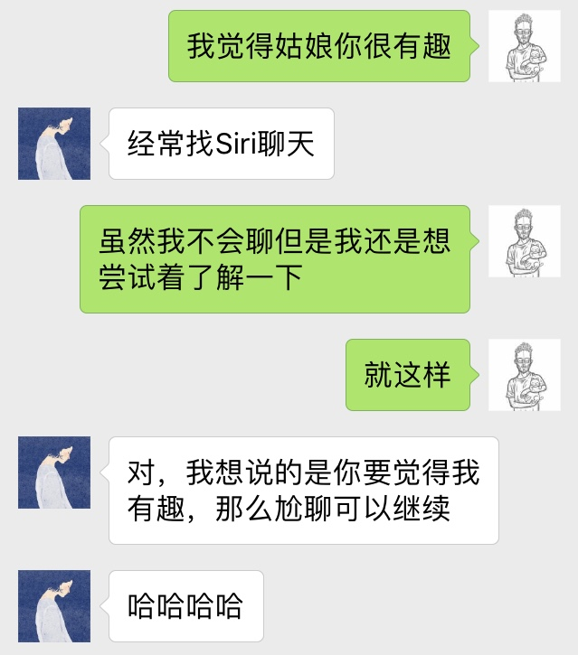  
### 其实吧，有的时候和你说话挺费脑筋的，因为你比较聪明  
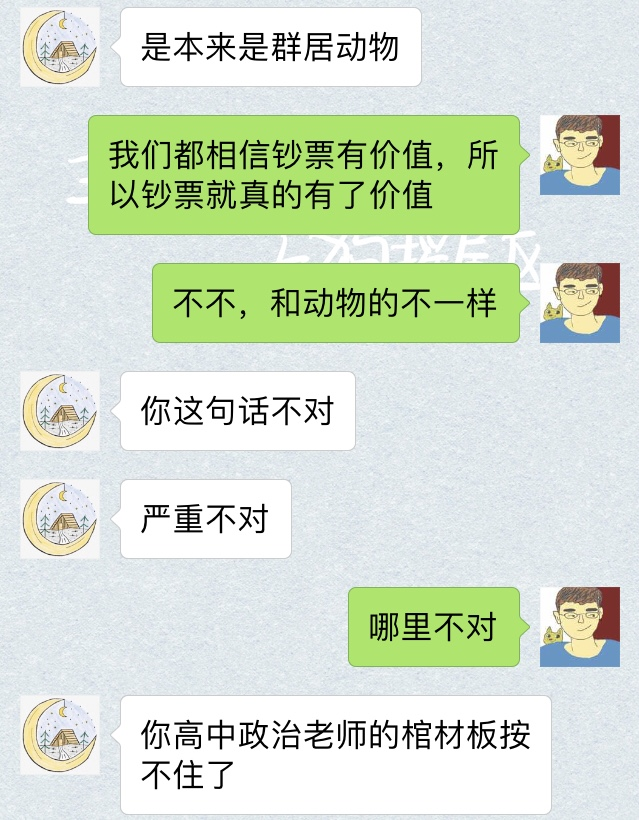  
### 但是呢，有的时候你又会有点傻乎乎的  
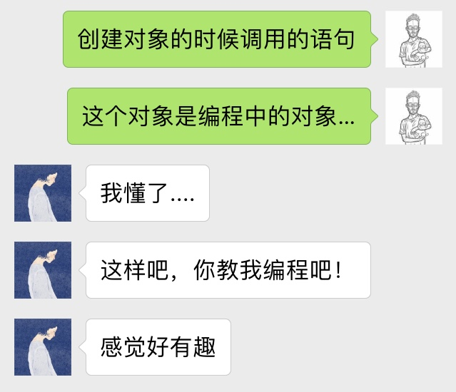  
### 还有萌萌哒的一面  
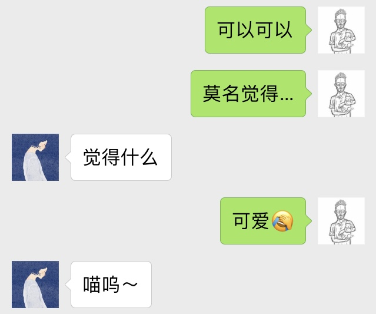  
### 随着时间的推移，我们渐渐熟悉彼此，首先你给我起了一个很好听的绰号  
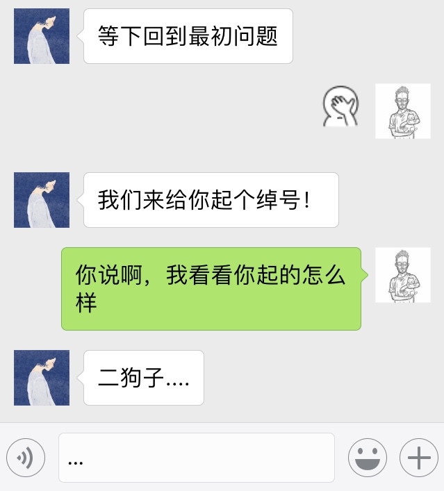  
### 然后呢，又给我画了头像  
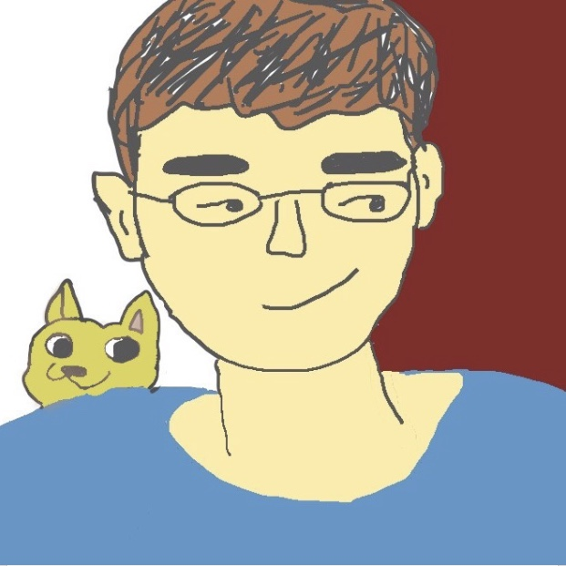  
### 我呢，想给你拍星星  
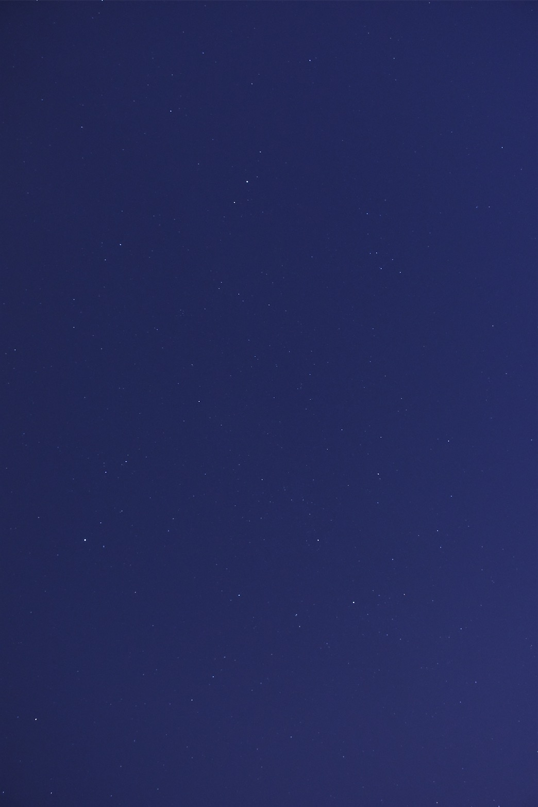  
### 想给你拍月亮  
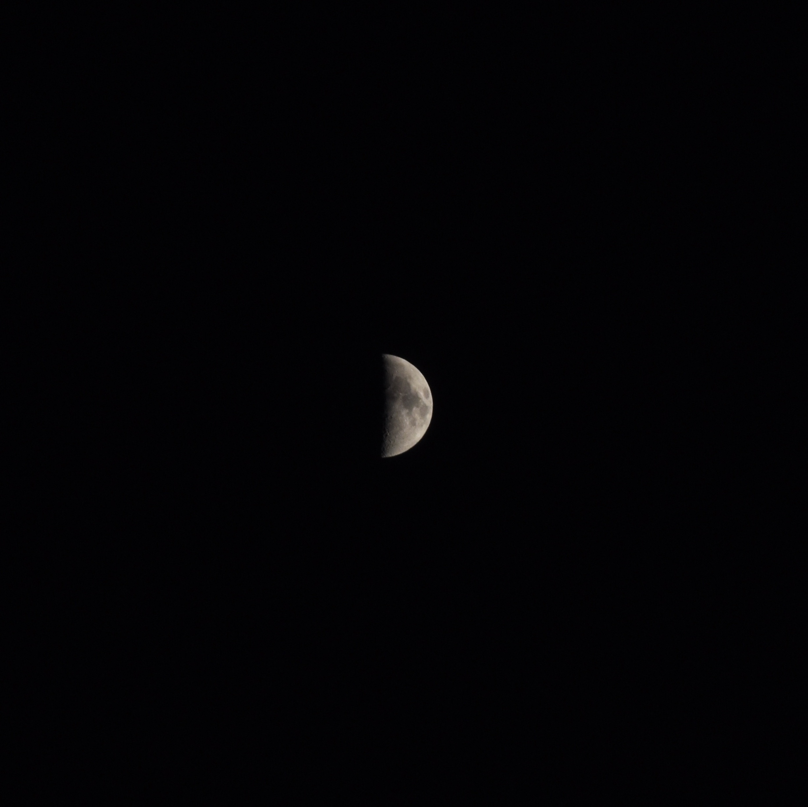  
### 可惜了人家姑娘，遇到了这么一个八竿子打不出一个闷屁的男生  
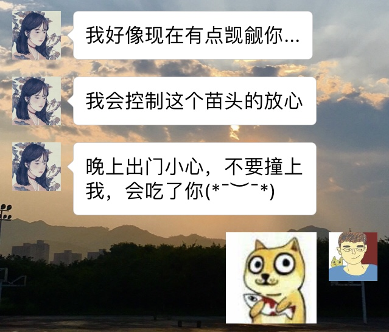  
### 开学前，我们远程过了个七夕，你的最后一句话让我琢磨了好久：她是喜欢谁呢...?  
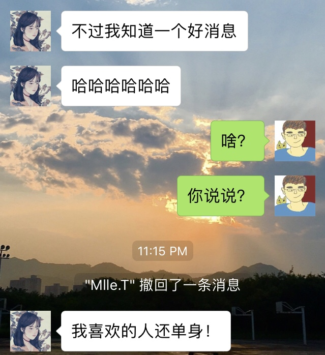  
### 当然，现在想想，我是挺想回到过去给自己一棍子的  

## 开学之后，一切都变了，换个文艺一点的说法：start of something new  
### 终于有人给我过生日  
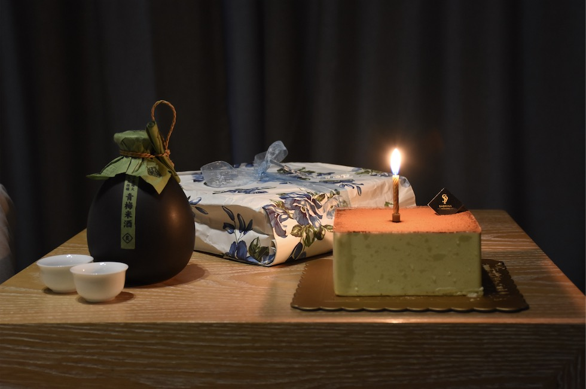  
### 陪我喝酒  
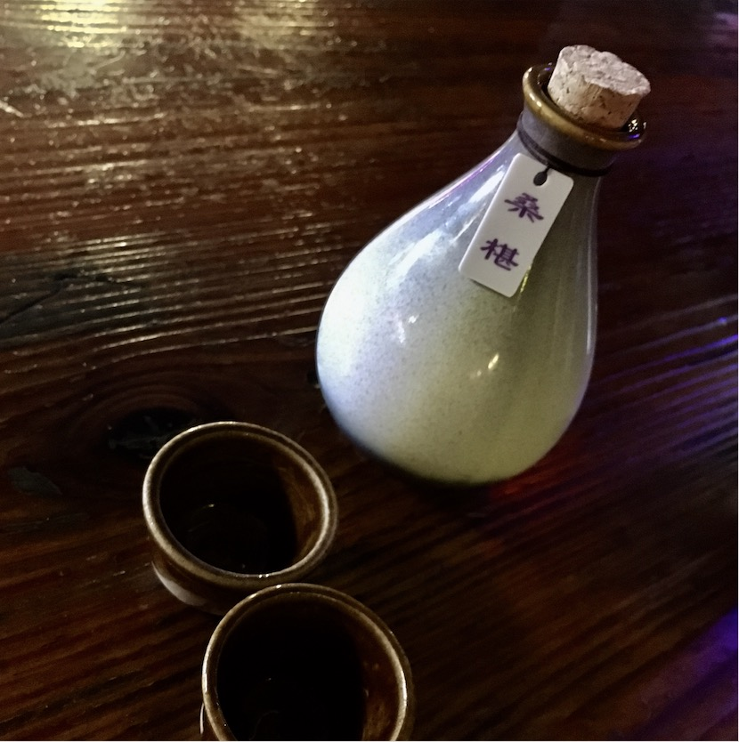  
### 和我出去玩  
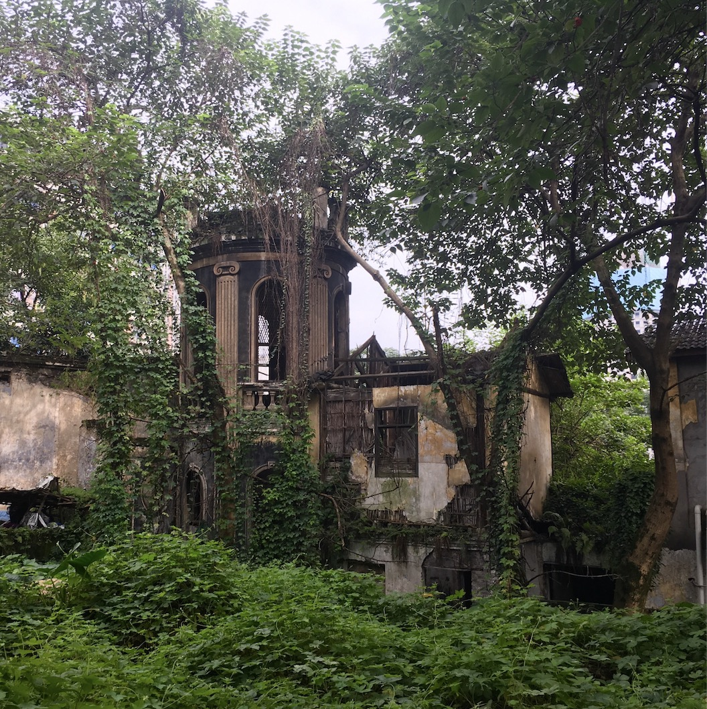  
### 你给我改发型  
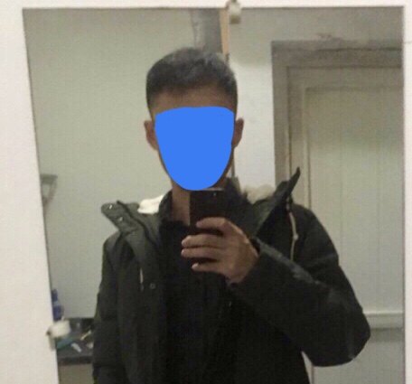  
### 选衣服  
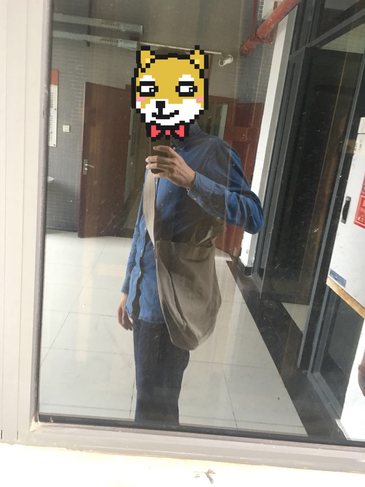  
### 我想给你画画  
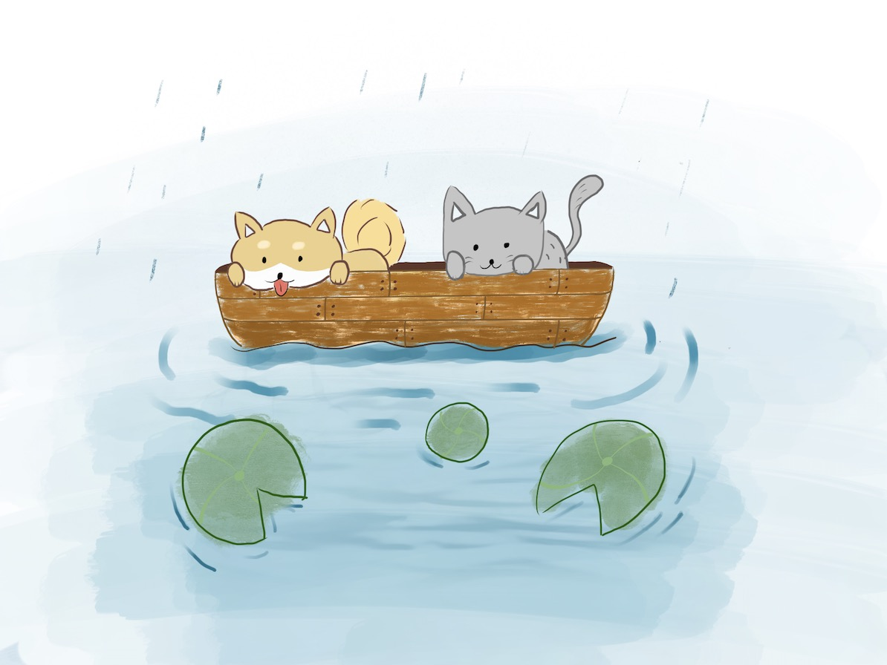  
### 想和你一起看日出日落  
  

### 还有很多事情，我想和你一起去做。  
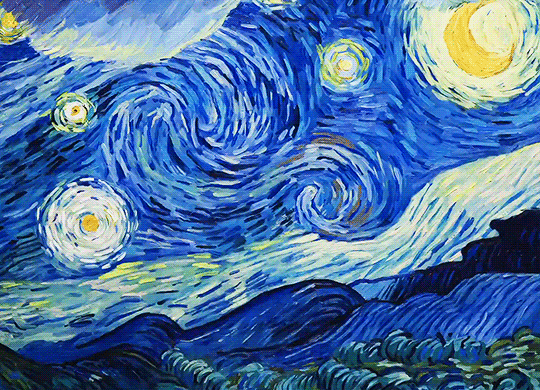  

### 最后  
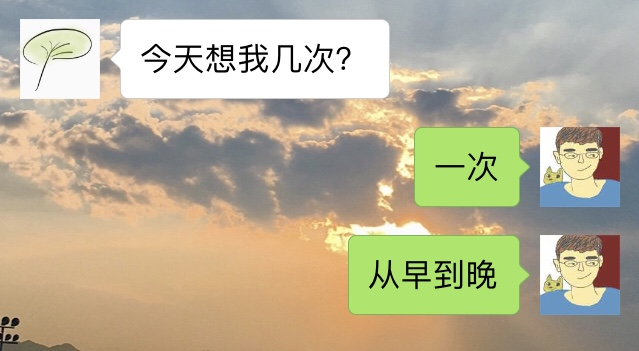  