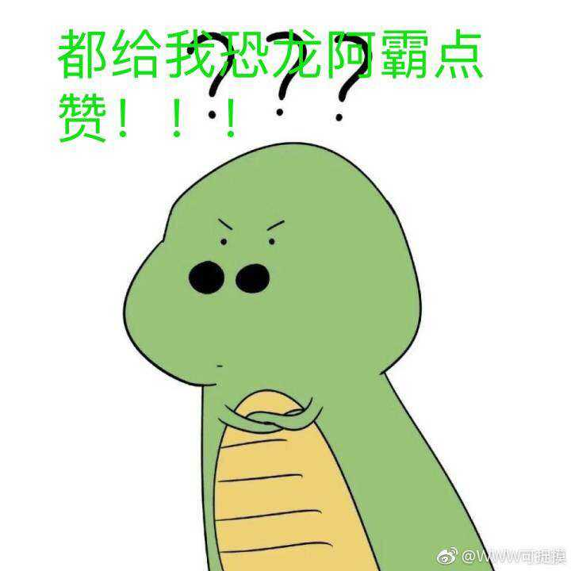

我想，无论是买啤酒的人，还是卖啤酒的人，都没有想过故事会发展成这样，因为故事的开始明明就很平常啊

但是谁让我忍不住一颗想要炫耀冰箱的心

还好，一开始我给你留下了一个错误的印象，你愿意搭理一个看上去还算有趣的人

但是不多久，这种尬聊的场景就会一次又一次的出现

其实吧，有的时候和你说话挺费脑筋的，因为你比较聪明

但是呢，有的时候你又会有点傻乎乎的

还有萌萌哒的一面

随着时间的推移，我们渐渐熟悉彼此，首先你给我起了一个很好听的绰号

然后呢，又给我画了头像

我呢，想给你拍星星

想给你拍月亮

可惜了人家姑娘，遇到了这么一个八竿子打不出一个闷屁的男生

开学前，我们远程过了个七夕，你的最后一句话让我琢磨了好久：她是喜欢谁呢...?

当然，现在想想，我是挺想回到过去给自己一棍子的
开学之后，一切都变了，换个文艺一点的说法：start of something new
终于有人给我过生日

陪我喝酒

和我出去玩

你给我改发型

选衣服

我想给你画画

想和你一起看日出日落

开心的事情，太多太多

当然，因为我的疏忽，有的时候会让你生气，但是每一次